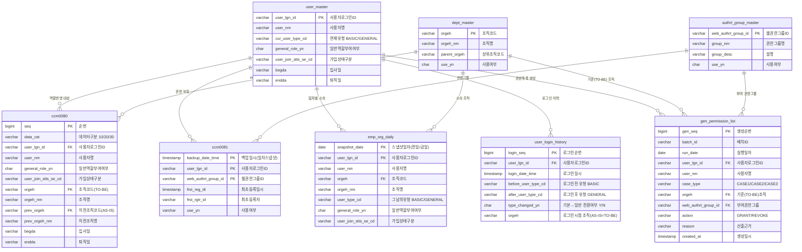

# Task1 부서이동 권한 자동설정 — CASE#1/2/3 구현용 더미 ERD

## 설계 원칙
- **재사용**: `ccm0080`(자동역할 반영 대상), `ccm0081`(권한 일자 백업) 그대로 사용
- **보강(더미)**: 현재 데이터에 없어서 CASE#2/#3를 막던 두 축을 추가
  - `emp_org_daily` — **일자별(전일/금일) 부서 전체 구성원** → CASE#1 정확 다수결 + CASE#2 전일 구성원
  - `user_login_history` — **로그인/유형(기본→일반) 전환 이력** → CASE#3
- **마스터/결과**: `dept_master`, `authrt_group_master`, 결과 `gen_permission_list`

## ERD (Mermaid)



## CASE ↔ 테이블 매핑

| CASE | 판정 조건 | 다수결/권한 산출에 쓰는 테이블 |
|---|---|---|
| **CASE#1** 부서코드 변경 | `ccm0080`: orgeh ≠ prev_orgeh (data_cat=10) | `emp_org_daily`(금일, orgeh=TO-BE 전원) + `ccm0081`(해당 구성원 최신권한) → **TO-BE 다수결** |
| **CASE#2** TO-BE 임직원 부재 | CASE#1인데 `emp_org_daily`(금일, TO-BE)에 구성원 0명 | `emp_org_daily`(**전일**, TO-BE) + `ccm0081`(**전일 backup_date_time**) → 전일 구성원 권한 |
| **CASE#3** 기본→일반 전환 | `user_login_history.type_changed_yn='Y'` (BASIC→GENERAL) | `emp_org_daily`(금일, orgeh=AS-IS=TO-BE) + `ccm0081` → 동일부서 개인별 권한 |

> 결과는 모두 `gen_permission_list`에 **개인별 권한 목록 + case_type**으로 적재 → S-PLF 전송.

## 왜 이 두 더미 테이블이 핵심인가
- `emp_org_daily`: 기존 `ccm0080`은 "이동 배치 명단"이라 ① 부서 **전원**이 아님(다수결 부정확), ② **시점(전일/금일)** 이 없음. 이 테이블이 두 문제를 동시에 해결 → CASE#1 정확도 + CASE#2 성립.
- `user_login_history`: 기존 데이터엔 로그인 이력이 전무 → CASE#3의 "기본→일반 전환" 트리거를 잡을 유일한 수단.

## DDL (로컬 PostgreSQL 18, 더미)

> 로컬 PG에는 원격 MariaDB의 `ccm0080`/`ccm0081` 데이터가 없으므로 **두 테이블도 함께 생성**합니다.
> 실행: `psql -U postgres -d taskdb -f this.sql`

```sql
-- ============================================================
--  Local PostgreSQL 18  |  Task1 CASE#1/2/3 dummy schema
-- ============================================================

-- 조직 마스터
CREATE TABLE dept_master (
  orgeh        VARCHAR(255) PRIMARY KEY,
  orgeh_nm     VARCHAR(255),
  parent_orgeh VARCHAR(255),
  use_yn       CHAR(1) DEFAULT 'Y'
);

-- 권한그룹 마스터
CREATE TABLE authrt_group_master (
  web_authrt_group_id VARCHAR(30) PRIMARY KEY,
  group_nm            VARCHAR(100),
  group_desc          VARCHAR(255),
  use_yn              CHAR(1) DEFAULT 'Y'
);

-- 사용자 마스터(허브)
CREATE TABLE user_master (
  user_lgn_id          VARCHAR(100) PRIMARY KEY,
  user_nm              VARCHAR(60),
  cur_user_type_cd     VARCHAR(10),   -- BASIC / GENERAL
  general_role_yn      CHAR(1),
  user_join_stts_se_cd VARCHAR(50),
  begda                VARCHAR(8),
  endda                VARCHAR(8)
);

-- [재사용] CCM0080 : DX 사용자 자동역할 반영 대상
CREATE TABLE ccm0080 (
  seq                  BIGINT PRIMARY KEY,
  data_cat             VARCHAR(2),
  user_lgn_id          VARCHAR(100),
  user_nm              VARCHAR(60),
  general_role_yn      VARCHAR(1),
  user_join_stts_se_cd VARCHAR(50),
  orgeh                VARCHAR(255),
  orgeh_nm             VARCHAR(255),
  prev_orgeh           VARCHAR(255),
  prev_orgeh_nm        VARCHAR(255),
  begda                VARCHAR(8),
  endda                VARCHAR(8),
  create_user_id       VARCHAR(50),
  create_date_time     TIMESTAMP(6),
  update_user_id       VARCHAR(50),
  update_date_time     TIMESTAMP(6)
);

-- [재사용] CCM0081 : 웹 권한그룹 백업(일자 스냅샷)
CREATE TABLE ccm0081 (
  backup_date_time    TIMESTAMP(6) NOT NULL,
  user_lgn_id         VARCHAR(100) NOT NULL,
  web_authrt_group_id VARCHAR(30)  NOT NULL,
  frst_reg_dt         TIMESTAMP(6),
  frst_rgtr_id        VARCHAR(200),
  last_mdfcn_dt       TIMESTAMP(6),
  last_mdfr_id        VARCHAR(200),
  use_yn              VARCHAR(1),
  PRIMARY KEY (backup_date_time, user_lgn_id, web_authrt_group_id)
);

-- [핵심] 일자별 임직원-조직 스냅샷 (전일/금일 전체 구성원)
CREATE TABLE emp_org_daily (
  snapshot_date        DATE         NOT NULL,
  user_lgn_id          VARCHAR(100) NOT NULL,
  user_nm              VARCHAR(60),
  orgeh                VARCHAR(255),
  orgeh_nm             VARCHAR(255),
  user_type_cd         VARCHAR(10),   -- 그날의 BASIC/GENERAL
  general_role_yn      CHAR(1),
  user_join_stts_se_cd VARCHAR(50),
  PRIMARY KEY (snapshot_date, user_lgn_id)
);
CREATE INDEX idx_eod_org ON emp_org_daily (snapshot_date, orgeh);

-- [핵심] 로그인/유형전환 이력
CREATE TABLE user_login_history (
  login_seq           BIGINT GENERATED ALWAYS AS IDENTITY PRIMARY KEY,
  user_lgn_id         VARCHAR(100) NOT NULL,
  login_date_time     TIMESTAMP(6),
  before_user_type_cd VARCHAR(10),  -- BASIC
  after_user_type_cd  VARCHAR(10),  -- GENERAL
  type_changed_yn     CHAR(1),      -- Y = 기본→일반 전환
  orgeh               VARCHAR(255)  -- 로그인 시점 조직(AS-IS=TO-BE)
);
CREATE INDEX idx_ulh_user ON user_login_history (user_lgn_id, login_date_time);

-- 결과: 개인별 권한 목록 + CASE 구분 (S-PLF 전송용)
CREATE TABLE gen_permission_list (
  gen_seq             BIGINT GENERATED ALWAYS AS IDENTITY PRIMARY KEY,
  batch_id            VARCHAR(64),
  run_date            DATE,
  user_lgn_id         VARCHAR(100) NOT NULL,
  user_nm             VARCHAR(60),
  case_type           VARCHAR(10),  -- CASE1 / CASE2 / CASE3
  orgeh               VARCHAR(255), -- 기준(TO-BE) 조직
  web_authrt_group_id VARCHAR(30),
  action              VARCHAR(10),  -- GRANT / REVOKE
  reason              VARCHAR(255),
  created_at          TIMESTAMP DEFAULT CURRENT_TIMESTAMP
);
CREATE INDEX idx_gpl_batch ON gen_permission_list (batch_id, user_lgn_id);

-- (선택) 외래키 — 더미/POC 편의상 생략 가능
-- ALTER TABLE emp_org_daily      ADD CONSTRAINT fk_eod_org FOREIGN KEY (orgeh) REFERENCES dept_master(orgeh);
-- ALTER TABLE ccm0081            ADD CONSTRAINT fk_c81_grp FOREIGN KEY (web_authrt_group_id) REFERENCES authrt_group_master(web_authrt_group_id);
-- ALTER TABLE user_login_history ADD CONSTRAINT fk_ulh_usr FOREIGN KEY (user_lgn_id) REFERENCES user_master(user_lgn_id);
```

### MariaDB → PostgreSQL 변환 포인트
| MariaDB | PostgreSQL |
|---|---|
| `BIGINT AUTO_INCREMENT` | `BIGINT GENERATED ALWAYS AS IDENTITY` |
| 인라인 `KEY idx (...)` | 별도 `CREATE INDEX idx ON t (...)` |
| `TIMESTAMP(6)` | `TIMESTAMP(6)` (동일 지원) |
| 나머지(`VARCHAR/CHAR/DATE/DEFAULT CURRENT_TIMESTAMP`) | 동일 |

## 참고
- `ccm0080`은 "**처리 대상 식별**"(누구를 이번에 처리할지 + AS-IS/TO-BE 조직) 역할로 축소되고, 다수결 **모수(부서 전원)**는 `emp_org_daily`가 담당하도록 분리하는 것이 정확도의 핵심입니다.
- `case_type`은 저장 컬럼이 아니라 **실행 시 판정**되는 값입니다(위 매핑 조건).
- FK는 더미/POC 편의상 느슨하게 둬도 되며, 성능상 `emp_org_daily(snapshot_date, orgeh)` 인덱스가 다수결 계산에 중요합니다.
