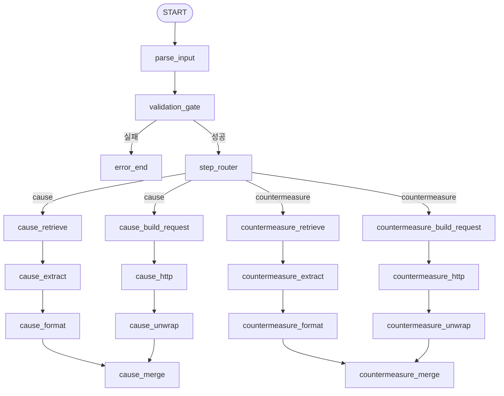
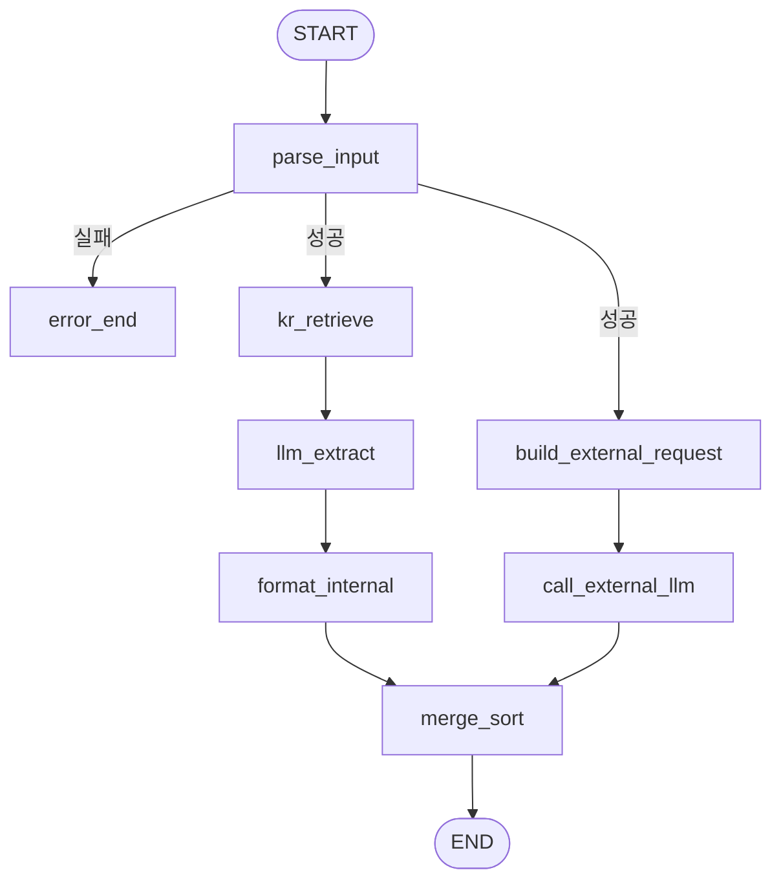
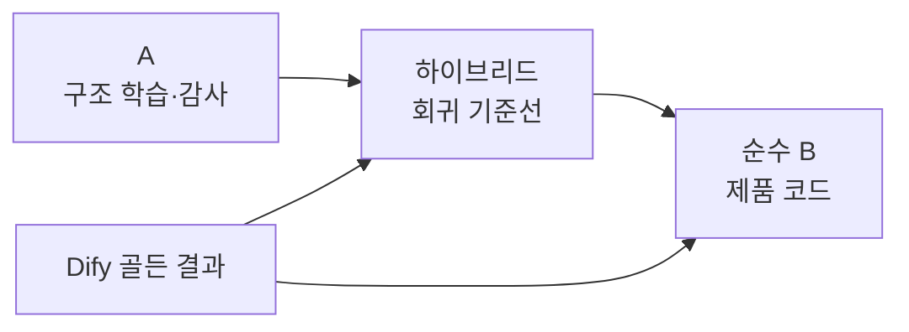

---
tags:
  - langgraph
  - dify
  - 과제5
  - 비교
created: 2026-06-30
---

# A · 하이브리드 · 순수 B 비교

## 1. 비교 목적

세 구현은 서로 다른 결과를 만드는 세 제품안이 아니다. 같은 비즈니스 동작을 유지하면서 Dify를 LangGraph로 옮기는 세 가지 관점을 보여준다.

- **A ↔ 하이브리드:** 그래프 토폴로지를 단순화하면 무엇이 줄어드는가?
- **하이브리드 ↔ 순수 B:** 같은 토폴로지에서 기존 코드를 이식하는 방식과 새로 설계하는 방식은 무엇이 다른가?
- **Dify ↔ LangGraph 구현:** 플랫폼을 바꿔도 비즈니스 계약이 유지되는가?

따라서 A와 B의 출력만 비교해서 우열을 정하는 것은 핵심을 놓친다. 중요한 비교 축은 구조, 코드 출처, 유지보수 경계다.

## 2. 한눈에 비교

| 항목 | A · literal | 하이브리드 | 순수 B · native |
|---|---|---|---|
| 주목적 | Dify→LangGraph 매핑 학습 | 빠르고 안전한 1차 이식 | 장기 유지보수 |
| 토폴로지 | Dify 구조 보존 | step 통합 | step 통합 |
| 활성 업무 노드 | 20 | 8 | 8 |
| 방향 edge | 25 | 11 | 11 |
| 원인/대책 표현 | 물리적으로 별도 노드 | 같은 노드를 파라미터화 | 같은 노드를 파라미터화 |
| 외부 호출 표현 | 요청→HTTP→언랩 분리 | 요청 생성+client 경계 | 요청 생성+client 경계 |
| Dify 코드 노드 | 거의 그대로 이식 | 핵심 코드만 이식 | 명세만 참고해 재작성 |
| orphan 더미 | marker로 보존 | 제거 | 제거 |
| 코드 구조 | 큰 단일 nodes 모듈 중심 | nodes 모듈+포트 | 기능별 작은 모듈 |
| Dify 대조 용이성 | 가장 높음 | 높음 | 상대적으로 낮음 |
| 유지보수성 | 낮음 | 중간 | 가장 높음 |
| 권장 용도 | 학습·감사·마이그레이션 설명 | 전환기 기준선 | 제품 코드베이스 |

## 3. 토폴로지 비교

### 3.1 A: Dify 캔버스를 코드로 펼친 구조



A의 장점은 Dify 캔버스의 노드가 LangGraph의 어느 함수로 옮겨졌는지 바로 찾을 수 있다는 점이다. 반면 원인과 대책의 대칭 구조가 그대로 복제되므로 수정 지점도 두 배가 된다.

### 3.2 하이브리드·순수 B: step 통합 구조



원인/대책 차이는 edge가 아니라 `step` 값으로 표현한다. 검색 질의, 프롬프트, schema name만 step에 따라 달라지고 실행 구조는 하나다.

이 단순화로 제거되는 것은 비즈니스 기능이 아니라 다음과 같은 구조적 중복이다.

- 원인/대책별 검색·추출·정형화 노드 복제
- 원인/대책별 외부 요청·호출·병합 노드 복제
- 별도 step 분기 노드
- Dify HTTP 응답 전달을 위한 우회 노드
- 과거 버전의 orphan 더미 노드

## 4. A와 하이브리드: 토폴로지 차이

### A가 더 잘 보여주는 것

- Dify의 노드와 edge가 어떻게 실행되는지
- 원인과 대책 분기가 캔버스에서 얼마나 중복되는지
- raw HTTP 전후에 왜 요청 생성과 언랩 단계가 존재했는지
- Dify에서 남은 미연결 노드가 무엇인지

### 하이브리드가 더 잘 보여주는 것

- LangGraph State를 중심으로 대칭 분기를 통합하는 방법
- fan-out으로 내부·외부 작업을 병렬 실행하는 방법
- wait-all fan-in으로 두 경로를 안전하게 합치는 방법
- 플랫폼 우회 노드를 제거하고 도메인 단계만 그래프에 남기는 방법

### 판단

A는 마이그레이션 과정을 설명하는 좋은 지도다. 하이브리드는 실제로 운용할 수 있는 더 작은 지도다. A를 장기 제품 코드로 유지하면 Dify의 제약까지 새 코드베이스에 영구 보존하게 된다.

## 5. 하이브리드와 순수 B: 코드 출처 차이

두 버전은 그래프 구조와 출력 계약이 같다. 차이는 노드 내부를 어떻게 만들었는지에 있다.

### 하이브리드

Dify에서 이미 검증된 다음 로직을 가능한 한 그대로 이식했다.

- 입력 검증과 개수 보정
- exclude 정규화
- 내부 후보의 QIR 문서 연결과 RAG 근거 생성
- 내부·외부 후보의 중복 제거, 정렬, meta 생성

장점:

- 기존 동작과 어긋날 위험이 작다.
- Dify 코드와 줄 단위로 대조하기 쉽다.
- 마이그레이션 초기의 골든 기준선으로 유용하다.

단점:

- 한 함수가 여러 책임을 가질 수 있다.
- Dify의 변수명과 데이터 모양이 새 코드에 남는다.
- 규칙 변경 시 함수 전체를 다시 이해해야 할 수 있다.

### 순수 B

Dify 코드는 요구사항을 확인하는 자료로만 사용하고, 책임별 작은 함수와 타입힌트로 다시 작성했다.

```text
native/
├─ nodes/
│  ├─ parse.py
│  ├─ retrieve.py
│  ├─ internal.py
│  ├─ external.py
│  └─ merge.py
├─ ports.py
├─ clients.py
├─ state.py
└─ graph.py
```

장점:

- 검증, 검색, 정형화, 외부 호출, 병합의 경계가 명확하다.
- 작은 함수 단위로 테스트와 변경이 쉽다.
- 운영 어댑터 교체 영향이 포트 경계 안에 머문다.
- 장기적으로 읽고 고치기 가장 쉽다.

단점:

- 재작성 과정에서 기존의 미세한 규칙을 놓칠 수 있다.
- 초기에는 하이브리드와의 동치 테스트가 반드시 필요하다.
- Dify 캔버스와 코드의 직접 대응 관계는 약해진다.

### 판단

하이브리드는 “기존 동작을 안전하게 옮기는 코드”, 순수 B는 “옮겨진 동작을 오래 관리하는 코드”에 가깝다.

## 6. 공통점과 의도적인 비차이

세 버전 모두 다음을 동일하게 보장한다.

- 같은 입력 검증 규칙
- 내부 5개·외부 5개 기본값과 최대 합계 10
- 외부부터 개수 축소
- exclude 정규화
- 내부 RAG와 외부 LLM 병렬 처리
- text 기준 중복 제거와 score 내림차순 정렬
- Responses API의 `previous_response_id` round-trip
- 외부 실패 시 내부 결과만 반환
- 동일한 성공·오류 출력 계약
- checkpointer를 사용하지 않는 무상태 실행

이 공통점 때문에 정상 출력이 같다는 사실만으로는 세 방식의 차이를 설명할 수 없다.

## 7. 비교 시 봐야 할 지표

| 비교 질문 | 적합한 대상 | 지표 |
|---|---|---|
| Dify 구조를 얼마나 충실히 옮겼는가? | A ↔ Dify | 노드 대응표, 분기, orphan, HTTP 우회 노드 |
| 단순화가 무엇을 제거했는가? | A ↔ 하이브리드 | 노드/edge 수, 중복 분기, step 파라미터화 |
| 재작성 로직이 동치인가? | 하이브리드 ↔ B | 오류 코드, 개수 보정, exclude, 정렬, meta |
| 제품 유지보수에 적합한가? | 하이브리드 ↔ B | 함수 책임, 타입, 테스트 단위, 어댑터 경계 |
| 플랫폼 이전이 성공했는가? | Dify ↔ 네이티브 | 골든 테스트, 프론트 출력 계약, 실패 전략 |

LLM과 RAG 결과는 비결정적이므로 문구 완전 일치보다 다음을 우선 비교해야 한다.

- 요청·반환 개수
- internal/external 분포
- 점수 정렬 규칙
- 중복·exclude 처리
- meta 카운트
- 오류 코드
- 외부 실패 시 partial 처리

## 8. 선택 가이드

### A를 선택할 때

- Dify 워크플로우를 교육하거나 리뷰해야 할 때
- 기존 노드와 새 노드의 대응 관계를 감사해야 할 때
- 단순화 전후를 시각적으로 설명해야 할 때

A는 학습 산출물로 유지하고 제품 실행 경로에서는 제외하는 것이 적절하다.

### 하이브리드를 선택할 때

- Dify와의 회귀 위험을 최소화하며 빠르게 이전해야 할 때
- 기존 코드 노드가 이미 충분히 검증되었을 때
- 순수 B의 동치성을 판단할 기준선이 필요할 때

하이브리드는 전환기 제품 후보와 회귀 기준선에 적합하다.

### 순수 B를 선택할 때

- 기능 변경과 운영 연동이 계속될 때
- 코난 RAGops 등 내부 인프라 교체가 예정되어 있을 때
- 테스트 가능성, 타입 안정성, 책임 분리가 중요할 때
- 장기 운영 코드베이스를 정해야 할 때

최종 제품 기준으로는 순수 B가 가장 적합하다.

## 9. 권장 운영 전략



1. A로 Dify와 LangGraph의 구조 대응을 설명한다.
2. 하이브리드를 Dify 코드 로직의 기준선으로 사용한다.
3. 순수 B를 장기 제품 코드로 발전시킨다.
4. Dify 골든 결과와 하이브리드 테스트를 유지해 순수 B의 변경을 검증한다.
5. 운영 안정화 후 A는 문서·교육용으로만, 하이브리드는 회귀 기준으로만 유지할지 결정한다.

## 10. 결론

- **A의 가치:** 구조를 그대로 보여준다.
- **하이브리드의 가치:** 기존 동작을 안전하게 옮긴다.
- **순수 B의 가치:** 같은 동작을 오래 관리할 수 있게 만든다.

세 구현은 경쟁 관계라기보다 마이그레이션 성숙도의 세 단계다. 학습과 감사에는 A, 전환과 회귀에는 하이브리드, 장기 제품에는 순수 B를 사용하는 구성이 가장 자연스럽다.

## 관련 문서

- [[langgraph 구현 설계]]
- [[LangGraph 구현 작업 과정 및 로직 정리]]
- [[dify 테스트 케이스]]

