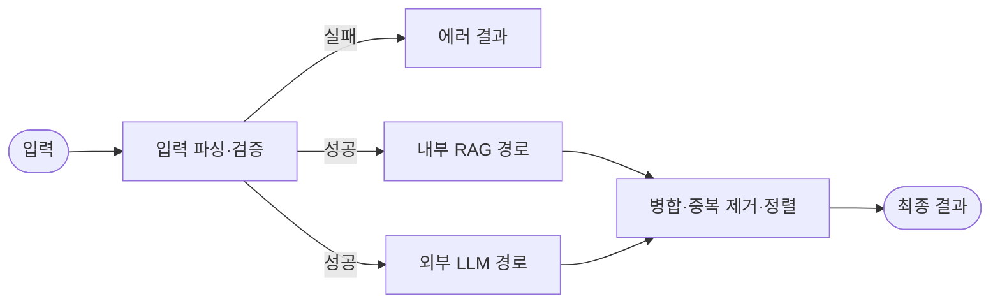
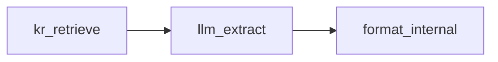
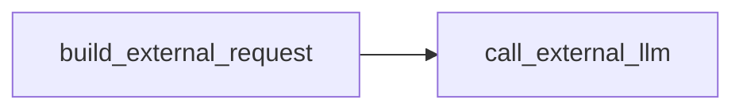

---
tags:
  - langgraph
  - dify
  - 과제5
  - 구현
created: 2026-06-30
source:
  - dify/대책서 작성 도우미 v0.0.7.yml
  - langgraph 구현 설계.md
---

# Dify 워크플로우 → LangGraph 구현 작업 과정 및 로직 정리

## 1. 구현 목표와 결과

Dify의 `대책서 작성 도우미 v0.0.7`을 같은 입출력 계약을 갖는 LangGraph 워크플로우로 옮겼다. 비교와 학습 목적에 맞춰 다음 세 구현을 만들었다.

| 구현 | 위치 | 목적 |
|---|---|---|
| A · literal | `measure-langgraph/literal/` | Dify 캔버스의 분기와 우회 노드를 최대한 그대로 보존 |
| 하이브리드 | `measure-langgraph/hybrid/` | Dify 코드 노드는 이식하고 그래프·외부 연동은 LangGraph 방식으로 단순화 |
| 순수 B · native | `measure-langgraph/native/` | 같은 명세를 유지보수하기 쉬운 네이티브 코드로 재작성 |

세 구현은 토폴로지와 코드 작성 방식이 다르지만 최종 비즈니스 동작은 동일하다.

## 2. 작업 과정

### 2.1 원본 워크플로우 분석

`dify/대책서 작성 도우미 v0.0.7.yml`의 노드 ID, 연결, 코드 노드, 프롬프트, Responses API 요청 형식을 분석했다.

핵심 흐름은 다음과 같다.



원인 추천과 대책 추천은 입력 필드와 프롬프트만 다르고 처리 구조는 대칭이다.

- 원인 단계의 검색 기준: `phenomenon`
- 대책 단계의 검색 기준: `cause`
- 내부 경로: 검색 → 구조화 추출 → RAG 근거 정형화
- 외부 경로: Responses API 요청 생성 → 호출 → 응답 해석
- 최종 경로: 내부·외부 후보 병합 → 문구 기준 중복 제거 → 점수 내림차순 정렬

### 2.2 공통 동작 계약 고정

구현 방식보다 먼저 세 버전이 공통으로 지켜야 할 규칙을 고정했다.

- 허용 step: `cause`, `countermeasure`
- 기본 추천 개수: 내부 5개 + 외부 5개
- 최대 합계: 10개
- 합계가 10을 넘으면 외부 개수부터 축소
- 둘 다 0이면 `INVALID_COUNT`
- exclude는 trim, 빈 문자열 제거, 순서 유지 중복 제거
- 외부 호출 실패는 전체 실패가 아니라 내부 결과만 반환하는 default-value 전략
- 세션 저장/checkpointer는 사용하지 않음
- 연속 추천 문맥은 `previous_response_id` 입력과 `meta.responseId` 출력으로 왕복

### 2.3 세 버전 병렬 구현

파일 충돌을 피하기 위해 구현별 디렉터리를 분리했다.

```text
measure-langgraph/
├─ literal/     # A
├─ hybrid/      # 하이브리드
└─ native/      # 순수 B
```

외부 인프라 없이도 검증할 수 있도록 세 버전 모두 검색기, 내부 추출기, 외부 LLM 클라이언트를 주입 가능한 포트로 분리했다. 테스트에서는 fake 구현을 주입하고, 운영에서는 실제 RAG·vLLM·OpenAI 어댑터를 주입한다.

### 2.4 통합 리뷰에서 반영한 사항

LangGraph의 wait-all fan-in은 두 개의 개별 edge가 아니라 선행 노드 목록을 하나의 edge로 지정해야 한다.

```python
graph.add_edge(
    ["format_internal", "call_external_llm"],
    "merge_sort",
)
```

이 표현으로 내부 경로와 외부 경로가 모두 완료된 뒤 `merge_sort`가 한 번만 실행된다.

추가로 다음을 교정했다.

- A의 시각적 방향 edge 수를 25개로 정정
- 순수 B가 비정상 내부 후보 하나를 만났을 때 전체 순회를 중단하지 않고 다음 후보를 검사하도록 `break`를 `continue`로 변경
- README의 패키지 import 예시와 의존성 버전 범위를 정리
- 원본 YAML의 비밀값을 구현 파일에 복사하지 않고 `OPENAI_API_KEY` 환경변수만 사용

## 3. 공통 LangGraph 로직

### 3.1 State

공통 State는 한 번의 추천 요청에 필요한 입력, 두 병렬 경로의 중간 결과, 최종 결과를 보관한다.

| 범주 | 주요 필드 | 의미 |
|---|---|---|
| 원본 입력 | `payload` | 프론트에서 전달한 요청 |
| 검증 결과 | `ok`, `error_code`, `message` | 정상 처리 가능 여부 |
| 추천 문맥 | `step`, `phenomenon`, `cause` | 원인/대책 단계와 검색 문맥 |
| 제외 조건 | `exclude_list`, `exclude_block` | 정규화된 제외 목록과 프롬프트 블록 |
| 요청 개수 | `internal_count`, `external_count` | 보정이 끝난 실제 요청 개수 |
| 모델 문맥 | `model`, `previous_response_id` | 외부 모델과 이전 응답 연결 |
| 내부 경로 | `kr_chunks`, `internal_items` | 검색 청크와 정형화된 내부 후보 |
| 외부 경로 | `external_request_body`, `external_response`, `response_id` | Responses API 요청·응답 |
| 최종 출력 | `result` | 프론트에 반환할 계약 |

내부 경로와 외부 경로가 서로 다른 State 키에 쓰기 때문에 병렬 실행 중 reducer 충돌이 없다.

### 3.2 입력 파싱과 검증

`parse_input`은 예외를 던져 그래프를 중단하지 않고 정상적인 오류 State를 반환한다.

| 오류 코드 | 조건 |
|---|---|
| `INVALID_STEP` | step이 cause/countermeasure가 아님 |
| `MISSING_PHENOMENON` | 원인 추천인데 현상이 없음 |
| `MISSING_CAUSE` | 대책 추천인데 원인이 없음 |
| `INVALID_COUNT` | 내부·외부 요청 개수가 모두 0이거나 유효하지 않음 |

성공하면 조건부 edge가 내부 RAG와 외부 LLM 경로를 동시에 시작한다. 실패하면 `error_end`로 바로 이동한다.

### 3.3 내부 RAG 경로



1. `kr_retrieve`
   - 원인 단계는 현상, 대책 단계는 원인을 검색 질의로 사용한다.
   - Dify 관리형 지식검색 대신 `Retriever` 포트를 호출한다.

2. `llm_extract`
   - 검색 결과에 근거한 `{text, source_doc}` 후보를 구조화 출력으로 받는다.
   - 운영 환경에서는 gemma/vLLM 또는 코난 RAGops 어댑터를 연결한다.

3. `format_internal`
   - `source_doc`의 `QIR-YYYY-NNNN` 식별자를 검색 청크와 연결한다.
   - 검색 유사도에 100을 곱해 score를 만든다.
   - `ragSource`에 문서·데이터셋·세그먼트·유사도·발췌를 기록한다.
   - exclude와 중복을 제거하고 `internal_count`까지만 남긴다.

### 3.4 외부 LLM 경로



`build_external_request`는 OpenAI Responses API용 요청을 만든다.

- `store: true`
- strict JSON schema: `{items: [{text, score}]}`
- 원인/대책별 instructions와 schema name
- 값이 있을 때만 `previous_response_id` 포함
- `ensure_ascii=False`로 JSON 직렬화

`call_external_llm`은 `OPENAI_API_KEY`를 환경변수에서 읽는다. 호출 실패 시 예외를 그래프 밖으로 전파하지 않고 빈 응답을 반환한다.

### 3.5 병합과 종료

`merge_sort`는 두 경로가 모두 끝난 뒤 실행된다.

1. Responses API의 `output → message → output_text`를 해석한다.
2. 내부 후보를 먼저 넣고 외부 후보를 합친다.
3. `text`가 같은 후보는 먼저 들어온 후보만 유지한다.
4. score가 없는 항목은 가장 낮은 우선순위로 두고 내림차순 정렬한다.
5. 실제 추가 개수와 요청 개수, 모델, response ID, partial 여부를 meta에 기록한다.

성공 출력:

```json
{
  "ok": true,
  "items": [
    {
      "text": "후보 문구",
      "score": 91.0,
      "source": "internal",
      "ragSource": {}
    }
  ],
  "meta": {
    "internalAdded": 1,
    "externalAdded": 0,
    "requestedInternal": 1,
    "requestedExternal": 1,
    "model": "gpt-5-nano",
    "responseId": null,
    "partial": true
  }
}
```

`partial=true`는 외부 후보를 요청했지만 외부 후보가 한 건도 추가되지 않았다는 뜻이다. 내부 결과가 있으면 전체 요청은 여전히 성공이다.

## 4. 구현별 실행 특성

### A

- 활성 업무 노드 20개
- START/END 포함 렌더링 노드 22개
- 방향 edge 25개
- 원인/대책 노드군을 물리적으로 분리
- 외부 요청 생성, HTTP, 응답 언랩을 별도 노드로 유지
- 미연결 Dify 더미 노드 2개는 그래프에 등록하지 않고 marker로 보존
- LangGraph가 없을 때 학습·테스트용 `LocalCompiledGraph` 사용 가능

### 하이브리드와 순수 B

- 활성 업무 노드 8개
- START/END 포함 렌더링 노드 10개
- 방향 edge 11개
- 원인/대책을 `state["step"]`으로 파라미터화
- 같은 통합 토폴로지를 사용하고 노드 내부 코드 작성 방식만 다름

## 5. 검증 결과

현재 Python 환경의 LangGraph 1.2.7에서 확인했다.

| 검증 | 결과 |
|---|---|
| A 단위 테스트 | 4/4 통과 |
| 하이브리드 단위 테스트 | 5/5 통과 |
| 순수 B 단위 테스트 | 4/4 통과 |
| Python compile | 통과 |
| 실제 StateGraph compile/invoke | 세 버전 통과 |
| Dify T1~T13 규칙 교차검증 | 13/13 동치 |
| 구현 디렉터리 비밀값 검사 | 하드코딩 없음 |

T1~T13 교차검증에서는 정상/오류 여부, 후보 개수, 내부·외부 분포, 보정된 요청 개수, exclude 정규화, 오류 코드를 비교했다.

## 6. 운영 연결 전 남은 작업

현재 코드는 워크플로우와 비즈니스 규칙 구현까지 완료된 상태다. 실제 운영 데이터로 실행하려면 다음 어댑터가 필요하다.

- 코난 RAGops 또는 사내 VectorStore용 `Retriever`
- 검색 청크 기반 structured output을 만드는 내부 LLM `InternalExtractor`
- 실제 네트워크와 재시도·timeout·관측 정책을 반영한 Responses API client
- Dify 실행 결과를 골든 데이터로 저장한 비결정적 결과 평가 체계

원본 Dify YAML에 실제 형식의 API 키가 포함되어 있으므로 해당 키는 폐기·교체하고, 이후에도 환경변수나 secret manager로만 관리해야 한다.

## 관련 문서

- [[langgraph 구현 설계]]
- [[LangGraph 3가지 구현 방식 비교]]
- [[dify 테스트 케이스]]
- [[대책서 작성 비즈니스 로직]]

