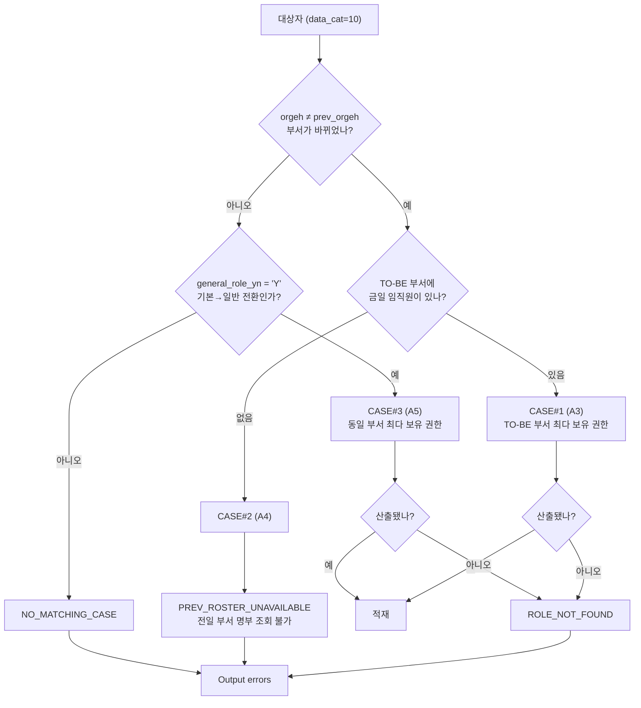

{"agent":{"agentId":"PLF_AUTH_AUTO_SET","agentName":"S-PLF 권한 자동 설정 에이전트","schemaVersion":"1.0"},"request":{"requestId":"REQ-PLF-20260810-001","sourceSystem":"S-PLF","requesterId":"tester","requestDateTime":"2026-08-10 03:00:00"},"userQuestion":null,"data":null}

  

